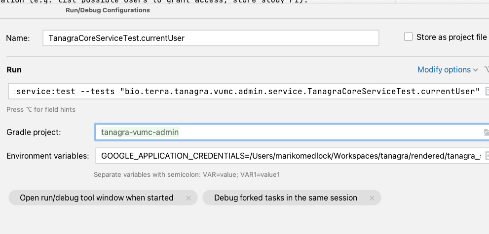

# Tanagra VUMC Admin Service

Tanagra is currently being developed by VUMC and Verily.
The project is shared across the All Of Us and Terra partnerships.

## Development

### Local Postgres
Tests and a local server use a local Postgres database.

To start a postgres container configured with the necessary databases:
```
./service/local-dev/run_postgres.sh start
```
To stop the container:
```
./service/local-dev/run_postgres.sh stop
```
Note that the contents of the database are not saved between container runs.

To connect to the database directly:
```
PGPASSWORD=dbpwd psql postgresql://127.0.0.1:5432/admin_db -U dbuser
```
If you get not found errors running the above command, but the `run_postgres.sh` script calls complete successfully,
check that you don't have PostGres running twice -- e.g. once in Docker and once in a local PostGres installation.

### Build And Run Tests
To get started, build the code and run tests:
```
./gradlew clean build
```

Before a PR can merge, it needs to pass the static analysis checks and tests. To run the checks and tests locally:
```
./gradlew clean check
```

### Local Server
```
./service/local-dev/run_server.sh
```
starts a local server on `localhost:8080`.

See [http://localhost:8080/swagger-ui.html](http://localhost:8080/swagger-ui.html) for the Swagger API page.

You can also run the local server with authentication disabled. This is useful when testing the UI, which does not
have a login flow yet. (We rely on IAP to handle the Google OAuth flow in our dev deployments.)

```
./service/local-dev/run_server.sh disable-auth
```

### Core Tanagra Service
#### Overview
We plan to deploy the VUMC admin service (this repo) and the [core Tanagra service](https://github.com/DataBiosphere/tanagra)
together. General outline of what each service is responsible for:
  - The core service will handle all data explorer functionality (e.g. build cohorts, export datasets, compute a
cohort breakdown).
  - The admin service will handle access control (e.g. which users have access to which 
studies/artifacts) and any VUMC-specific information (e.g. list possible users to grant access, store study PI). 

It's not a hard line though and we expect ongoing discussions around functionality that doesn't fall neatly into
one service or the other.

#### Deployments
The `admin.tanagra-core` set of configuration properties (in `application.yml` and `application-test.yml`) tell
the admin service which core service deployment to connect to. When developing the admin service, it's helpful to have
a core service to point your local server at, instead of having to mock everything.

Verily's test and dev deployments include both the core and admin services. So currently, these config properties point 
to the Verily `dev` environment. This could be changed to point to the Verily `test` environment (values below) or a 
VUMC environment in the future. (The Verily `dev` environment is generally more stable than the `test` environment, 
though neither is a production environment.)
```
tanagra-core:
    base-path: https://tanagra-test.api.verily.com
    oauth-client-id: 730051649108-uepfa779jvl5ct2u7thfkqje5gda0ona.apps.googleusercontent.com
    use-adc: true
```

### Authentication
The Verily environments are behind [IAP](https://cloud.google.com/iap) and users need to be explicitly allow-listed
before they can hit any endpoints there. I went ahead and allow-listed Broad and VUMC service accounts. The Broad 
service account is used by this repo's GitHub actions for running tests.
  - `tanagra@broad-tanagra-dev.iam.gserviceaccount.com`
  - `tanagra-admin-worker@victr-tanagra-deploytest.iam.gserviceaccount.com`

You can run a local admin service that talks to a core service by setting the application default credentials
before kicking off the service:
```
export GOOGLE_APPLICATION_CREDENTIALS=path/to/service/account/key/file.json
./service/local-dev/run_postgres.sh start
./service/local-dev/run_server.sh
```

Tests that talk to the core service will also need these credentials. You can set them as above and run tests
from the command line.
```
export GOOGLE_APPLICATION_CREDENTIALS=path/to/service/account/key/file.json
./gradlew service:test
```
You can also set the environment variable in an IntelliJ run configuration and run tests from the IDE.

